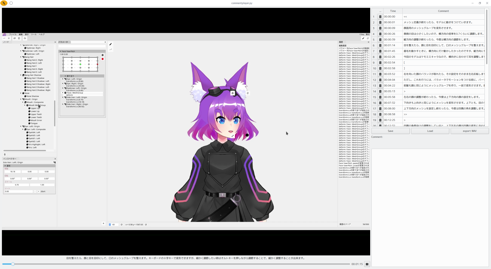

# Comment Player



Code is generated by GPT-4. More than 90% of code are generated automatically and unmodified.
Following is the decription of this player generated by GPT-4 using only source code as input.

# Video Player with Comment Overlay

This is a video player with a comment overlay that allows you to watch videos and add timed comments to specific moments in the video. The player is built using PySide2 and leverages the VOICEVOX server for text-to-speech synthesis.

## Features

- Play videos with adjustable playback rate.
- Add comments to specific moments in the video.
- Comment overlay shows comments at the corresponding time in the video.
- Supports special notation for controlling playback speed and defining skipped zones.
- Comments can be saved and loaded for later use.

## Input and Output

- **Input:** The user provides the path to a video file as a command-line argument when running the script.
- **Output:** The video player window opens, and the user can play, pause, and adjust the video's playback rate. The user can also add comments to specific moments in the video using a text box. These comments will be displayed as an overlay on the video at the corresponding time.

## How to Use

1. **Requirements:** Before running the script, ensure you have the required Python packages installed. Install them using the following command:
```
pip install PySide2 requests MeCab unidic pandas alkana tqdm qtawesome pydub wave
```

2. **Run the Script:** To use the video player, run the Python script with the path to the video file as the first command-line argument. Optionally, you can also specify the playback rate and audio speed scale as the second and third arguments, respectively.
```
python video_player.py <video_file_path> [playback_rate] [audio_speed_scale]
```
3. **Video Controls:** The video player window will open. You can control the video playback using the play/pause button. Adjust the playback rate using the slider.

4. **Add Comments:** While the video is playing, you can add comments to specific moments by typing them in the text box below the video. Press Enter to submit the comment. The comment will be displayed as an overlay on the video at the corresponding time.

5. **Special Notation:** The comment box supports special notation to control playback speed and define skipped zones. Use `>[n]` to fast-forward and `<[n]` to slow down. For example, `>>>` will increase the playback speed, and `<<<` will decrease it. Additionally, `[` and `]` notations define the start and end of skipped zones, respectively.

6. **Save and Load Comments:** You can save the comments you added by clicking the "Save" button. To load previous comments, click the "Load" button.

7. **Edit Comment Offset:** To adjust the timestamp of a comment, click on the timestamp in the comments table, and an input box will appear. Type the desired timestamp in `HH:MM:SS` format and press Enter to update the comment's offset.

8. **Close the Player:** When you close the video player window, the script will exit.

**Note:** The script requires the VOICEVOX server to be running on `http://localhost:50021` for text-to-speech synthesis. Make sure the server is available before running the video player.

Please enjoy using the video player with comment overlay to enhance your video watching experience!


# Video Comment Overlay Tool

## Overview

This tool provides the ability to overlay text and audio comments on a given video. It uses various libraries like OpenCV, PIL, moviepy, ffmpeg, tqdm, pydub, MeCab, and unidic to handle video and text processing, and requests to communicate with external APIs.

The main functionalities include:
- Converting alphabets to Katakana.
- Reading comments from a JSON file.
- Creating text images and overlaying them on the video.
- Overlaying audio comments.
- Previewing the video with overlaid comments.
- Generating the final video file with both text and audio comments.

## Features

1. **Text Comments Overlay**: Overlay text comments at specific time intervals over a video.
2. **Audio Comments Overlay**: Overlay audio comments to a video.
3. **Previewing Video**: Preview the video with overlaid comments without saving it.
4. **Generate Final Video**: Create the final video with both text and audio comments.

## Input / Output files

### Input:

- **Video File**: Path to the source video file on which comments will be overlaid.
- **Comments File**: A JSON file named `<video-filename>.comments.json`, containing the text comments with timing details, located in the same directory as the input video.

### Output:

- **Final Video File**: The generated video with both text and audio comments overlaid, named as `<video-filename>_final.mp4`, saved in the same directory as the input video.

## Usage of the Command

### Generating Preview Video:

Use the following command to generate a preview of the video with comments:

```bash
python <script-name.py> <video-filename> --preview <audio-speed-scale>
```

### Combining Text Overlay and Audio Comments:

Use the following command to combine the text overlay video and audio comments:

```bash
python <script-name.py> <video-filename> --audio
```

### Generating Final Video with Text and Audio Comments:

Use the following command to generate the final video:

```bash
python <script-name.py> <video-filename>
```

### Parameters:

- `<script-name.py>`: The name of the Python script.
- `<video-filename>`: The path to the input video file.
- `<audio-speed-scale>`: (Optional) A float value to control the speed of the audio.

## Dependencies

Make sure the following libraries are installed in your environment:

- OpenCV
- PIL
- moviepy
- ffmpeg
- tqdm
- pydub
- MeCab
- unidic
- requests
- pandas
- alkana

Also, ensure the font file `/usr/share/fonts/opentype/noto/NotoSansCJK-Bold.ttc` is available on your system.

## License

Specify your license here.

## Contributing

Specify your contribution guidelines here.
